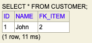
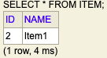
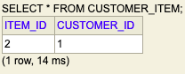

# Spring Boot Mapping Demo With H2 database

There are three basic entity relationships:-

* One-to-One
* One-to-Many/Many-to-one
* Many-to-Many

## Installation

Import Maven based project in any of your Favourite IDE.

```bash
./mvnw spring-boot:run
```
## Output
Open in Browser

Access H2 Database.

```
http://localhost:8080/h2-console
```

## Usage
### MainClass.java
run() method is run when the application is started. The data is added in the database.

```java
	@Override
	public void run(String... args) throws Exception {
		Customer customer = new Customer("John");
		Item item1 = new Item("Item1");
		customer.setItem(item1);
		customerRepository.save(customer);
		
```


### Customer.java
Following annotations are used in the Customer Entity class to join two tables.Check the class file to view other entities.

```java
@OneToOne(cascade = CascadeType.ALL)
	@JoinTable(name = "customer_item",
			joinColumns = {@JoinColumn(name = "customer_id")},
			inverseJoinColumns = {@JoinColumn(name = "item_id")})
	private Item item;
```


### Item.java
As JoinColumns and InverseJoinColumns are used in the customer class there is no need to add any annotation to join the entities.

## Output





## Configuration
### application.properties

```c
spring.jpa.show-sql = true

# Enabling H2 Console
spring.datasource.url=jdbc:h2:mem:testdb
spring.jpa.defer-datasource-initialization=true
spring.h2.console.enabled=true

# Enable Web Access
spring.h2.console.settings.web-allow-others=true
```